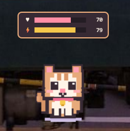

# Pixel Pet

A tiny pixel cat that lives on your desktop.

Pixel Pet is a Windows desktop virtual companion that can walk around your desktop, react to interactions, change its behaviour based on its mood, remind you to take breaks, and generally make your desktop a little less boring.

## Demo



A short screen recording of Pixel Pet in action is available here:

[Watch the demo](docs/demo/Interaction.mp4)

## Why I Built It

I wanted to build something just for fun.

My main area is AI/ML, and I did not have much experience with web development or Electron. Instead of making another ML project, I decided to learn something unfamiliar by building a small desktop application.

The original idea was very simple:

> "What if a pixel pet actually lived on my desktop?"

It turned into a surprisingly fun learning project.

I also used ChatGPT as a learning and development assistant throughout the project to understand unfamiliar concepts, troubleshoot errors, explore implementation ideas, and improve the code.

The goal was not to blindly generate an application, but to learn, experiment, debug, and actually get the project working.

## Features

- Desktop pixel-art cat
- Autonomous movement around the desktop
- Multiple animations
- Idle, walking, sitting, sleeping, eating, playing and other behaviours
- Happiness and Energy statistics
- Mood-based behaviour
- Pet, Feed and Play interactions
- Random/contextual messages
- Break reminders
- System tray controls
- Pause and timed-pause options
- Persistent settings
- LocalStorage-based persistence
- Windows portable executable

## Tech Stack

- Electron
- JavaScript
- HTML
- CSS
- Node.js
- SVG
- LocalStorage
- electron-builder

## How It Works

The application is divided into several small managers instead of putting everything into one large file.

```text
Electron Main Process
        |
      IPC
        |
     Preload
        |
Renderer Process
        |
  Pet Controller
        |
  +-----+-----+-----+
  |           |     |
Animation   Movement  Behavior
  |           |     |
  +-----+-----+-----+
        |
   Pet State
        |
   +----+----+
   |         |
 Stats   Interaction